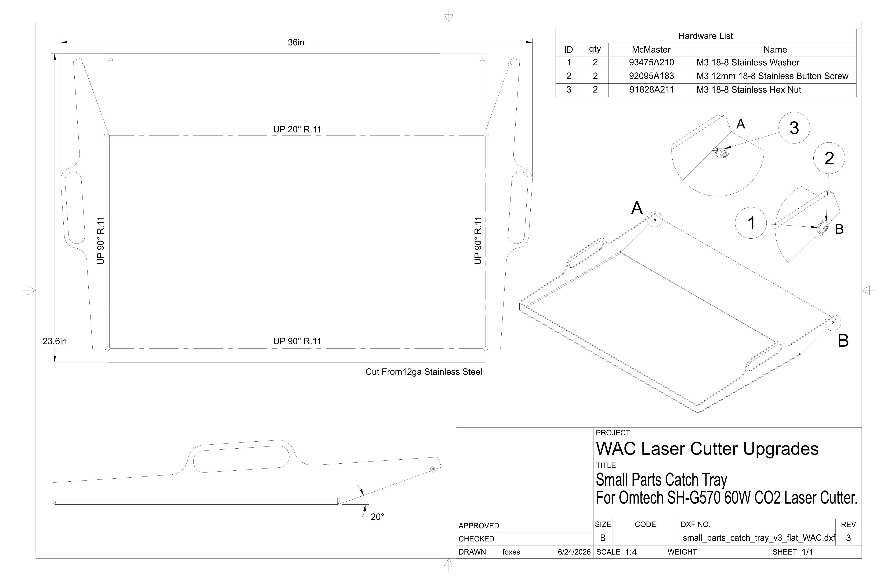
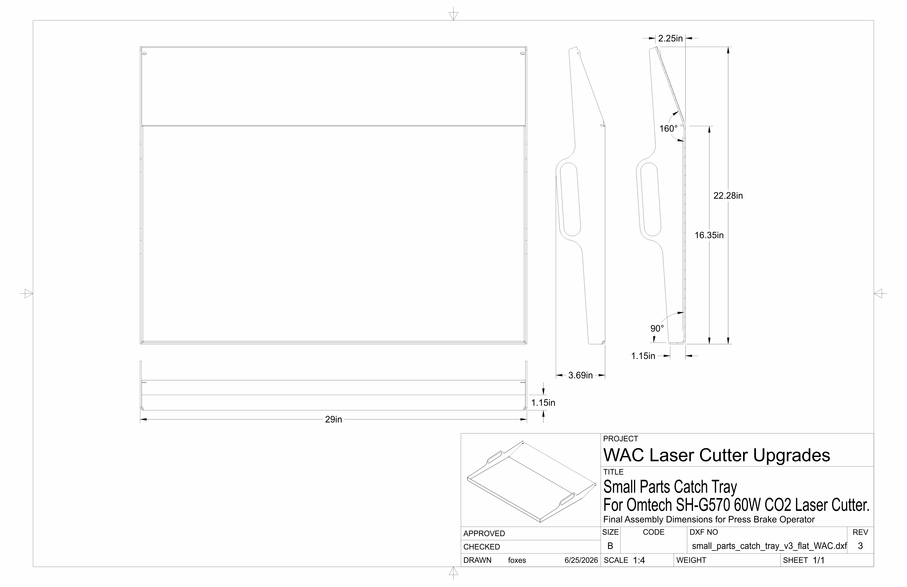

# Laser Cutter Small Parts Catch Tray
This is a small parts catch tray upgrade for an Omtech SH-G570 60W CO2 Laser Cutter. It is placed at the bottom of the machine to prevent small parts that fall through the material support slats from interfering with the z-axis belts and allow for easy collection and cleanup of offcuts.

## Fabrication Files
> 📂 **[laser-cutter-small-parts-catch-tray-WAC](laser-cutter-small-parts-catch-tray-WAC)/**
> - 📁 [`dxf`](dxf/)/ — *DXF fabrication files*
>   - 🗒️ [`small_parts_catch_tray_v3_bendlines_WAC.dxf`](dxf/small_parts_catch_tray_v3_bendlines_WAC.dxf) — *DXF with bend center and extent lines noted*
>   - 🗒️ [`small_parts_catch_tray_v3_flat_WAC.dxf`](dxf/small_parts_catch_tray_v3_flat_WAC.dxf) — *DXF flat pattern for fiber laser*
> - 🗒️ [`small_parts_catch_tray_v3_drawing_WAC.pdf`](small_parts_catch_tray_v3_drawing_WAC.pdf) — *Engineering drawing for fabrication and assembly*
> - 🗒️ [`small_parts_catch_tray_v3_final_Dims_drawingWAC.pdf`](small_parts_catch_tray_v3_final_Dims_drawingWAC.pdf) — *Final Dimensions for press brake tooling calculations*

_Tray to be cut from 12ga Stainless Steel; approx flat pattern dimensions: 36x24"_
## Parts List
_Note: qty given as needed for assembly, without respect to package quantity from sources_

_Requires 1x [`small_parts_catch_tray_v3_flat_WAC.dxf`](dxf/small_parts_catch_tray_v3_flat_WAC.dxf)_
| qty | name | source |
| ------------: | :-----------: | :-----------: |
| 2 | M3 washer | [McMaster](https://www.mcmaster.com/93475A210/) |
| 2 | M3 12mm button screw | [McMaster](https://www.mcmaster.com/92095A183/) |
| 2 | M3 nut | [McMaster](https://www.mcmaster.com/91828A211/) |
| 4 | Rubber Feet | [Amazon](https://a.co/d/0giqnjOn) |

## Engineering Drawing

    

[`small_parts_catch_tray_v3_drawing_WAC.pdf`](small_parts_catch_tray_v3_drawing_WAC.pdf)

    

